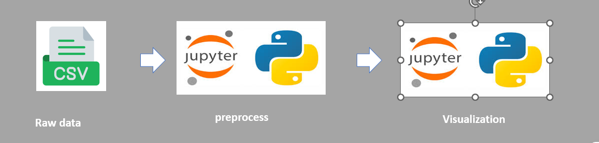
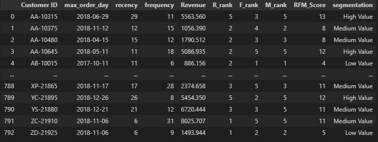
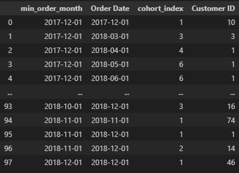
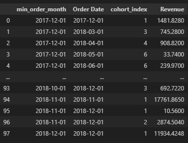
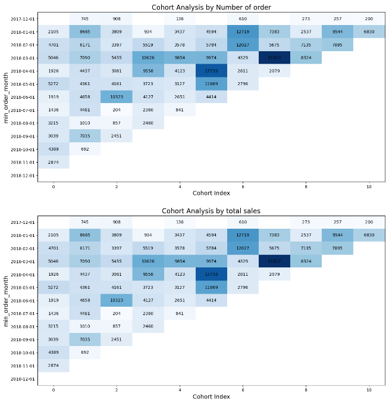
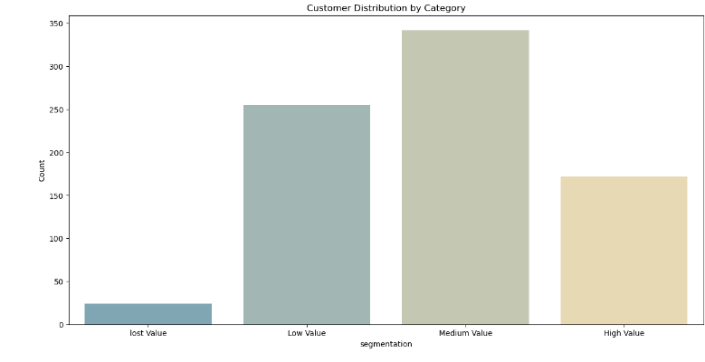

# Customer Behavior Analysis ETL Project

## Project Overview
This project focuses on building a complete ETL pipeline to analyze customer behavior data. 
The processed data is used to create insights into key customer metrics like recency, frequency, monetary value, and customer segmentation.

The pipeline involves the following main steps:
1. **Data extraction** from raw transaction data (CSV format).
2. **Data preprocessing** using Python (Jupyter Notebook).
3. **ETL process** for transforming and modeling data.
4. **Data visualization** for insights into customer behavior through cohort and RFM analysis.

---

## Pipeline Overview

### 1. **Raw Data (CSV File)**
   - Raw transaction data is provided in CSV format. This data includes customer information, purchase dates, and transaction amounts.

   

### 2. **Data Preprocessing (Python - Jupyter)**
   - The raw data is loaded into Jupyter Notebook, where it is cleaned and transformed into a structured format. RFM (Recency, Frequency, Monetary) metrics are calculated, and cohort groups are created.

  
  
  

### 3. **Data Visualization**
   - Data visualization tools are used to display customer distribution, cohort behavior, and key customer segments, helping the business gain insights into customer behavior and trends.

   
   

---

## How to Use

The processed data consists of the following elements:

**RFM Analysis**: Calculating Recency (days since last purchase), Frequency (number of purchases), and Monetary (total revenue) for each customer.
**Cohort Analysis:** Tracking groups of customers based on their first purchase month and analyzing their behavior over time.
The model enables us to:

- Identify high-value customers based on their RFM scores.
- Analyze how customer behavior changes over months using cohort analysis.
- Support the process of marketing campaign

---

## License
This project is licensed under the MIT License. See the `LICENSE` file for details.
